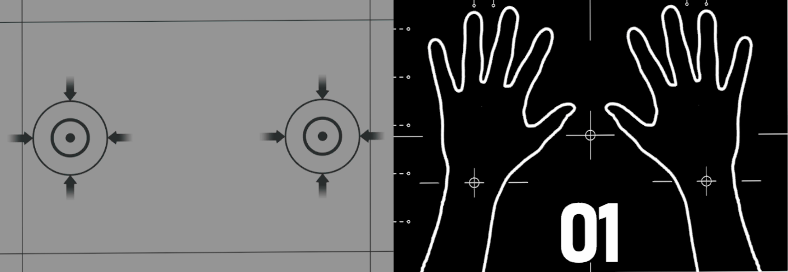
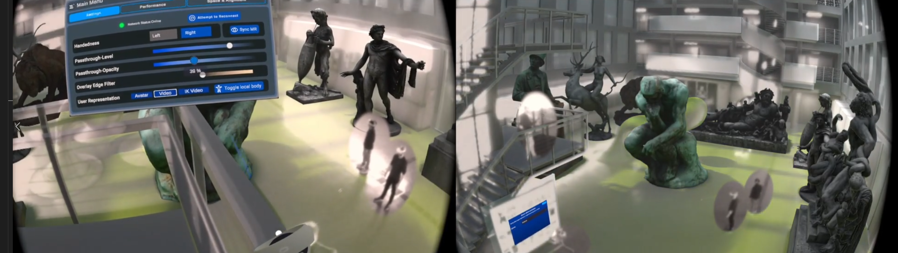

# ViewR: Architectural-Scale Multi-User Mixed Reality with Mobile Head-Mounted Displays


_ViewR_ is a framework for co-located multi-user mixed reality with mobile head-mounted displays, allowing architectural spaces of arbitrary size to be transformed into immersive multi-user visualisation arenas.

## How to install:

### The full ViewR package:

1. Clone repository
2. Install dependencies:
    -   Normcore 2.4.1              
            https://assetstore.unity.com/packages/tools/network/normcore-free-multiplayer-voice-chat-for-all-platforms-195224
    -   Oculus 46.0:                
            https://developer.oculus.com/downloads/package/unity-integration/46.0
    -   Surge (Into plugin folder)  
            https://assetstore.unity.com/packages/tools/utilities/surge-107312
3. Add Normcore AppID               
    https://normcore.io/dashboard/app/applications/create

### Just the calibration package:

1. Install package through git URL:     
2. Add "CalibrationManager" and "CalibrationStations" prefabs to your SceneContent
3. Set references in CalibrationManager
    -   CenterEye- Camera of the player
    -   TransformToMove - the gameobject which is at the end calibrated (usally the tracking space of the camera)
    -   Left/RightHandAnchor - Gameobjects which resemble either the hand and/or controller positions. This is used for the feedback UI
    -   Left/Right wrist - The wrist joints of the tracked hands which should match the position in the calibration station image
    -   Left/Right controller calibration point - The point on the controller which should match the point on the calibration stations. 

## How to use

### Calibration

For the calibration system: place calibration stations at same position as in the real world. The corresponding sheets can be printed on A3 paper with the picutres under: "Images/CalibrationStations/"
Controllers are used with primary button changable in "ControllerBasedCalibrator" under the "CalibrationManager"



### Blending

To enable passthorugh blending with your model, drag it under the "SpaceContainer -> World -> Space"
To adjust the blending on runtime, open the menu with the left controllers menu button
Content which should stay fully virtual can be placed inside "Scene Content"




## References & BibTex

[Research Paper - DOI](https://doi.org/10.1109/tvcg.2023.3299781)

```
@article{schierViewRArchitecturalScaleMultiUser2023,
	title = {{ViewR}: Architectural-Scale Multi-User Mixed Reality with Mobile Head-Mounted Displays},
	url = {https://ieeexplore.ieee.org/document/10210595/},
	doi = {10.1109/TVCG.2023.3299781},
	journaltitle = {{IEEE} Transactions on Visualization and Computer Graphics},
	author = {Schier, Florian and Zeidler, Daniel and Chandran, Krishnan and Yu, Zhongyuan and McGinity, Matthew},
	date = {2023},
}
```
